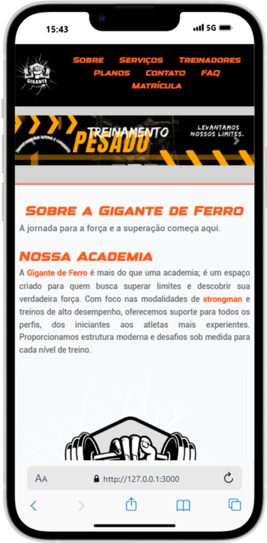
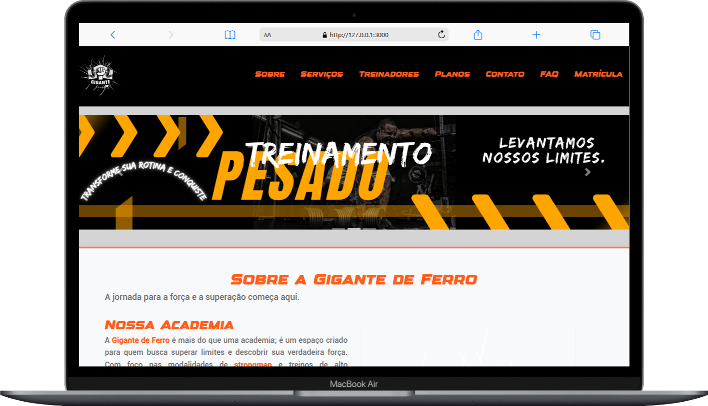

# Gigante de Ferro - Academia

## Descrição do Projeto
O site **Gigante de Ferro** é o projeto final do curso de front-end e tem como objetivo apresentar uma academia com foco em treinamentos de força e modalidades de strongman. 

# Paleta de Cores

Esta paleta de cores foi criada para transmitir uma estética industrial, com tons de cinza e metálico, representando força, resistência e poder.

## Cores Principais

As cores principais são representadas por tons de cinza, metálicos e preto, que transmitem a ideia de robustez e solidez.

- **Cinza Escuro**: #2D2D2D
- **Cinza Médio**: #6B6B6B
- **Laranja**: #FF5D1C
- **Cinza Claro**: #D4D4D4
- **Preto**: #000000

## Cores de Destaque

As cores de destaque incluem laranja e vermelho, que adicionam energia e dinamismo ao design.


- **Vermelho**: #FF6F61
- **Cinza Claro Escuro**: #F1F1F1 (usado para áreas de contraste suave)

## Outras Cores

- **Azul Claro**: #E0F7FA (para um toque suave e refrescante)
- **Cinza Claro Escuro**: #F1F1F1 (usado para áreas de contraste suave)
- **Sombra de Card**: rgba(0, 0, 0, 0.1) (para efeitos de sombra sutis)

<div>
    
    
</div>

## Lista de Tarefas do Projeto
- [x] Estruturar o layout inicial com HTML
- [x] Definir paleta de cores
- [x] Aplicar estilização com CSS para cada seção
- [X] Adicionar interatividade com JavaScript nas áreas de FAQ e formulário de contato
- [x] Implementar responsividade para dispositivos móveis
- [x] Revisão final e ajustes de layout e estilo

## Tipografia
Sugestões para fontes:
- **Fonte principal**: fonts Designer.otf format opentype
- **fonte secundaria**: fonts Roboto-Medium.ttf format truetype

Essas fontes podem ser importadas diretamente do DaFont:
```html
<link href="https://www.dafont.com/designer-2.font" rel="stylesheet">
<link href="https://www.dafont.com/pt/roboto.font" rel="stylesheet">
